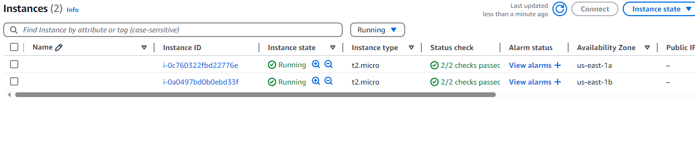
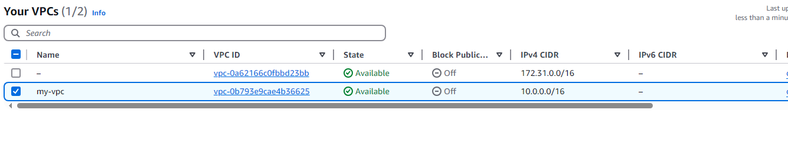
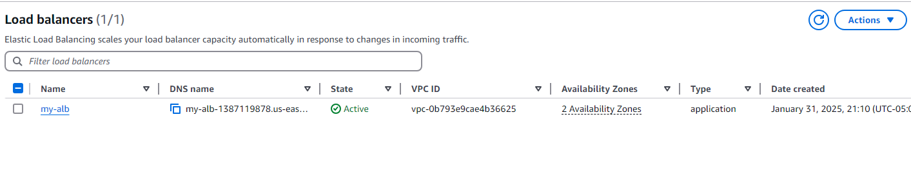
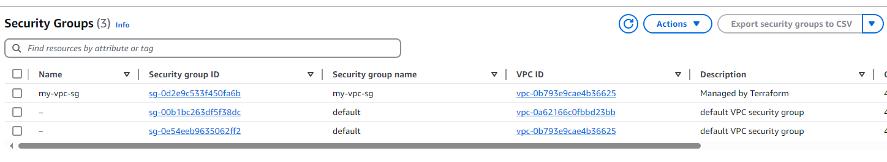
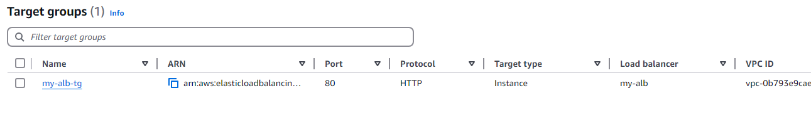
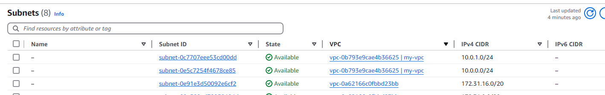
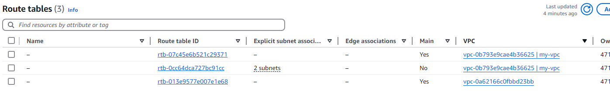
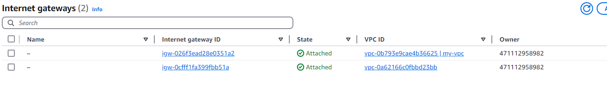
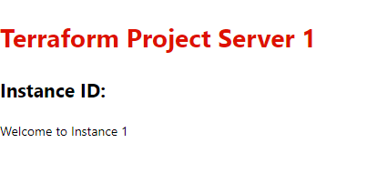
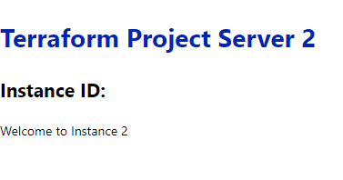

# Simple client-server Infrastructure

A simple deployment of a client-server infrastucture via terraform with VPC, subnets, Load Balancer, Internet gateway, Routing table, target group, and servers. 

DNS for load balancer will also be outputted to access the server through a single URL.

Best praticies, where ever applicable, are implemented.

## Steps to deploy

### Initialize Terraform

In your terminal, navigate to the directory containing your Terraform configuration files and run:

```
terraform init
```

This command initializes the Terraform working directory, downloading any necessary provider plugins.

### Apply the Configuration

Run the following command to create the AWS resources defined in your Terraform configuration:

```
terraform apply
```

Terraform will display a plan of the changes it's going to make. Review the plan and type "yes" when prompted to apply it.

### Verify Resources

After Terraform completes the provisioning process, you can verify the resources created in the AWS Management Console or by using AWS CLI commands.

You will this after the resources are created.

- **Server Instances**



- **VPC**



- **Load balancer**



- **Security group**



- **Target group**



- **Subnets**



- **Route Table**



- **Internet Gateway**



When you access the server via web browser, you will see this.

- **Server 1**



- **Internet Gateway**



### Destroy Resources

If you want to remove the resources created by Terraform, you can use the following command:

```
terraform destroy
```

Be cautious when using `terraform destroy` as it will delete resources as specified in your Terraform configuration.